# **Assembly notes**

Please note that depending on the kit version, you may not have to follow all the steps:

* If you are building a MiniChord from scratch, start at [PCB Manufacturing](#pcb-manufacturing)
* If you have the "PCB kit" or the "electronics kit", start at [Through-hole soldering](#through-hole-soldering)
* If you have the "full kit" start at [Final assembly](#final-assembly)

In any case, bill of material (BOM) and necessary tools are listed at the beginning of each section.

# **PCB Manufacturing**

Manufacturing files for the PCB are available in the [Source section](/source) in Gerber format. 

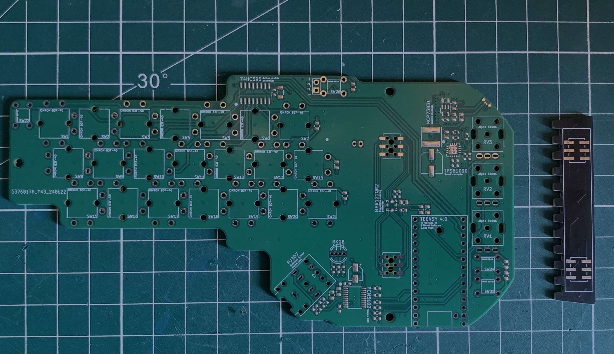

A MiniChord is composed of two PCB:

* The main PCB that is a four layer 1.6mm board;
* The touch zone PCB that is a two layer 1.6mm board (please remember that this PCB will be visible, so choose colour accordingly and remove any marking that the fab house would like to add). 

Any good fab house should accept those files for manufacture.

# **SMD Soldering**

    
 <b>BOM</b> 

<table class="table table-striped table-hover">
<thead>
<tr>
<th><strong>ID</strong></th>
<th><strong>Value</strong></th>
<th><strong>Footprint</strong></th>
<th><strong>Quantity</strong></th>
</tr>
</thead>
<tbody>
<tr>
<td><strong>&gt;&nbsp; C1, C2</strong></td>
<td>10uf</td>
<td>1608Metric</td>
<td>2</td>
</tr>
<tr>
<td><strong>&gt;&nbsp; C4, C9, C10</strong></td>
<td>2.2uf</td>
<td>2012Metric</td>
<td>3</td>
</tr>
<tr>
<td><strong>C5</strong></td>
<td>100uf</td>
<td>Elec_6.3x5.7</td>
<td>1</td>
</tr>
<tr>
<td><strong>C6</strong></td>
<td>100uf</td>
<td>3216Metric</td>
<td>1</td>
</tr>
<tr>
<td><strong>&gt;&nbsp; C3, C7, C8, C11-C14, C19</strong></td>
<td>100n</td>
<td>1608Metric</td>
<td>8</td>
</tr>
<tr>
<td><strong>C15</strong></td>
<td>10uf</td>
<td>Elec_4x5.4</td>
<td>1</td>
</tr>
<tr>
<td><strong>&gt;&nbsp; C16, C17</strong></td>
<td>2.2nf</td>
<td>1608Metric</td>
<td>2</td>
</tr>
<tr>
<td><strong>C18</strong></td>
<td>4.7uf</td>
<td>2012Metric</td>
<td>1</td>
</tr>
<tr>
<td><strong>D3</strong></td>
<td>LED_Dual_AAKK</td>
<td>side led</td>
<td>1</td>
</tr>
<tr>
<td><strong>L1</strong></td>
<td>6.8uH</td>
<td>SWPA60xxS</td>
<td>1</td>
</tr>
<tr>
<td><strong>R1</strong></td>
<td>1k</td>
<td>2012Metric</td>
<td>1</td>
</tr>
<tr>
<td><strong>R3</strong></td>
<td>330k</td>
<td>1608Metric</td>
<td>1</td>
</tr>
<tr>
<td><strong>R4</strong></td>
<td>680</td>
<td>2012Metric</td>
<td>1</td>
</tr>
<tr>
<td><strong>&gt;&nbsp; R2, R5</strong></td>
<td>1.8M</td>
<td>1608Metric</td>
<td>2</td>
</tr>
<tr>
<td><strong>R6</strong></td>
<td>220k</td>
<td>1608Metric</td>
<td>1</td>
</tr>
<tr>
<td><strong>R7</strong></td>
<td>1M</td>
<td>1608Metric</td>
<td>1</td>
</tr>
<tr>
<td><strong>R8</strong></td>
<td>2k</td>
<td>2012Metric</td>
<td>1</td>
</tr>
<tr>
<td><strong>&gt;&nbsp; R9, R10</strong></td>
<td>2k2</td>
<td>2012Metric</td>
<td>2</td>
</tr>
<tr>
<td><strong>&gt;&nbsp; R11-R14, R16, R38-R40</strong></td>
<td>10k</td>
<td>2012Metric</td>
<td>8</td>
</tr>
<tr>
<td><strong>R15</strong></td>
<td>75k</td>
<td>1608Metric</td>
<td>1</td>
</tr>
<tr>
<td><strong>&gt;&nbsp; R27-R30</strong></td>
<td>22</td>
<td>1608Metric</td>
<td>4</td>
</tr>
<tr>
<td><strong>R34</strong></td>
<td>560</td>
<td>1608Metric</td>
<td>1</td>
</tr>
<tr>
<td><strong>R35</strong></td>
<td>100</td>
<td>1608Metric</td>
<td>1</td>
</tr>
<tr>
<td><strong>R36</strong></td>
<td>200</td>
<td>1608Metric</td>
<td>1</td>
</tr>
<tr>
<td><strong>&gt;&nbsp; R31, R32, R37</strong></td>
<td>470</td>
<td>1608Metric</td>
<td>3</td>
</tr>
<tr>
<td><strong>U2</strong></td>
<td>TPS61090</td>
<td>PVQFN-N16_EP2.7x2.7mm</td>
<td>1</td>
</tr>
<tr>
<td><strong>U3</strong></td>
<td>MCP73831-2-OT</td>
<td>SOT-23-5</td>
<td>1</td>
</tr>
<tr>
<td><strong>U4</strong></td>
<td>74HC595</td>
<td>SOIC-16_3.9x9.9mm_P1.27mm</td>
<td>1</td>
</tr>
<tr>
<td><strong>U5</strong></td>
<td>PCM5102</td>
<td>TSSOP-20_4.4x6.5mm_P0.65mm</td>
<td>1</td>
</tr>
<tr>
<td><strong>U6</strong></td>
<td>MPR121QR2</td>
<td>UQFN-20_3x3mm_P0.4mm</td>
<td>1</td>
</tr>
</tbody>
</table>

 
The main PCB requires some SMD components. If you are experimented with SDM soldering it is possible to do that step yourself. However it requires quite advanced capabilities to properly solder the IC packages used. The "PCB kit" contains the PCB with the SMD components pre-soldered. 

For the placement of the component, please refer to [this document](./ressources/smd_assembly/g66188.png).

Once all the component are soldered, your PCB should look like this:

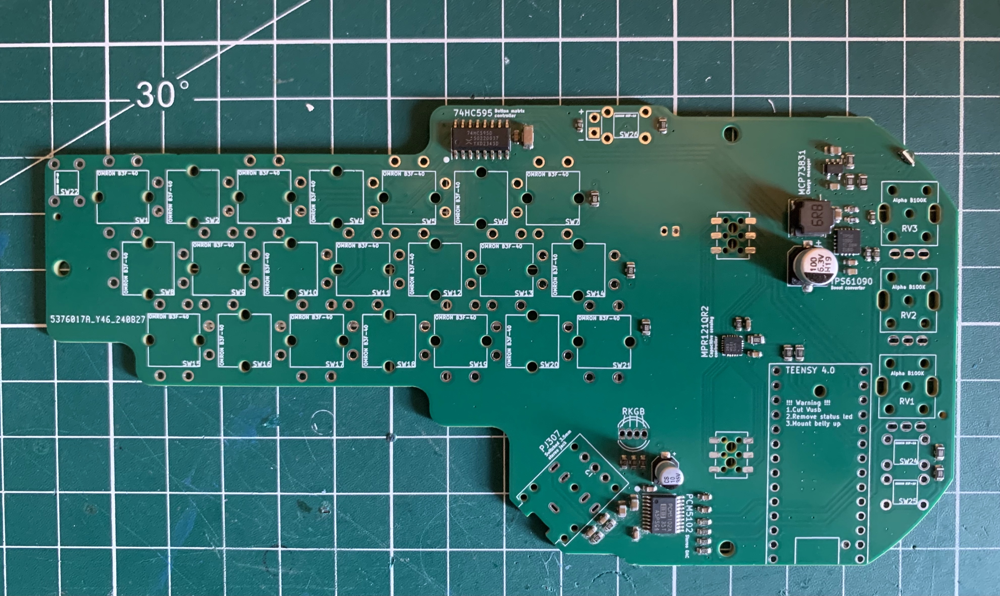

# **Through-hole soldering**

    
 <b>BOM</b> 

<table class="table table-striped table-hover">
<thead>
<tr>
<th><strong>ID</strong></th>
<th><strong>Part</strong></th>
<th><strong>Link</strong></th>
<th><strong>Included in “PCB kit”</strong></th>
<th><strong>Quantity</strong></th>
</tr>
</thead>
<tbody>
<tr>
<td><strong>D1</strong></td>
<td>Red LED</td>
<td><a href="https://www.mouser.fr/ProductDetail/604-WP169XID">Mouser</a></td>
<td>No</td>
<td>1</td>
</tr>
<tr>
<td><strong>D2</strong></td>
<td>5mm RKGB LED</td>
<td>-</td>
<td>Yes</td>
<td>1</td>
</tr>
<tr>
<td><strong>J2</strong></td>
<td>Switched Audio Jack&nbsp;</td>
<td><a href="https://www.mouser.fr/ProductDetail/490-SJ-3566AN">Mouser</a></td>
<td>No</td>
<td>1</td>
</tr>
<tr>
<td><strong>J3</strong></td>
<td>JST PH 2mm 2pin male angled</td>
<td>-</td>
<td>Yes</td>
<td>1</td>
</tr>
<tr>
<td><strong>N/A</strong></td>
<td>503450 1000mAh battery</td>
<td>-</td>
<td>Yes</td>
<td>1</td>
</tr>
<tr>
<td><strong>&gt;&nbsp; RV1-RV3</strong></td>
<td>Potentiometer</td>
<td><a href="https://www.mouser.fr/ProductDetail/317-2090F-100K">Mouser</a></td>
<td>No</td>
<td>3</td>
</tr>
<tr>
<td><strong>&gt;&nbsp; SW22, SW24, SW25, SW26</strong></td>
<td>Tactile switch 6x6mm</td>
<td><a href="https://www.mouser.fr/ProductDetail/653-B3F-1050">Mouser</a></td>
<td>No</td>
<td>2</td>
</tr>
<tr>
<td><strong>&gt;&nbsp; SW1-SW21</strong></td>
<td>Tactile switch 12x12mm</td>
<td><a href="https://www.mouser.fr/ProductDetail/653-B3F-4050">Mouser</a></td>
<td>No</td>
<td>21</td>
</tr>
<tr>
<td><strong>&gt;&nbsp; J1, J4</strong></td>
<td>Touch header female</td>
<td><a href="https://www.mouser.fr/ProductDetail/855-M20-7810345R">Mouser</a></td>
<td>No</td>
<td>2</td>
</tr>
<tr>
<td><strong>N/A</strong></td>
<td>Touch header male</td>
<td><a href="https://www.mouser.fr/ProductDetail/855-M20-8760346">Mouser</a></td>
<td>No</td>
<td>2</td>
</tr>
<tr>
<td><strong>U1</strong></td>
<td>Teensy 4.0</td>
<td>PJRC</td>
<td>No</td>
<td>1</td>
</tr>
<tr>
<td><strong>N/A</strong></td>
<td>Teensy headers</td>
<td><a href="https://www.mouser.fr/ProductDetail/200-TSW13220TS">Mouser</a></td>
<td>No</td>
<td>1</td>
</tr>
</tbody>
</table>

<b>Note: </b>

<ul>
<li>If you have the "PCB kit", purchase the additional components from Mouser, and the Teensy from PJRC or any other reseller;</li>
<li>If you have the "electronics kit", all component both from Mouser and the "PCB kit" are included. Just purchase the Teensy from PJRC or any other reseller.</li>
</ul>

To facilitate ordering from Mouser, here is a <a href="https://www.mouser.fr/api/CrossDomain/GetContext?syncDomains=www&amp;returnUrl=https%3a%2f%2fwww.mouser.com%2fProjectManager%2fProjectDetail.aspx%3fAccessID%3d8661b1e86b&amp;async=False&amp;setPrefSub=False&amp;clearPrefSub=False">prefilled basket</a>. 

    
 <b>Tools</b> 

    <ul>
 
<li>Soldering iron and solder wire; </li>
<li>X-acto knife (or another precise cutter);</li>
<li>Diagonal cutting pliers (the Knipex "Super Knips" are worth the price);</li>
<li>[Optional] Multimeter.</li>
</ul>

Before starting the soldering, it might be useful to identify the position of each component and do a dry run assembly. This will ensure you properly identify the position of each part and, in consequence, that you indeed have all the components of the BOM. 

## Parts preparation

Some parts require a few modification before starting with the soldering. 

### Teensy preparation 

First, some small modifications need to be made to the Teensy 4.0 Board. 

**The onboard led needs to be disabled**. This step is purely aesthetic so if you don't feel confortable doing that modification it is ok (it will simply give your MiniChord a soft orange glow). 

The led is next to the pin 13 of the Teensy. To identify it, simply plug your teensy using a micro USB cable. The led will blink.

There is a trace on the top side between the led and the reset pushbutton. Cut that trace using the X-acto (the specific position is in red in the image below). 

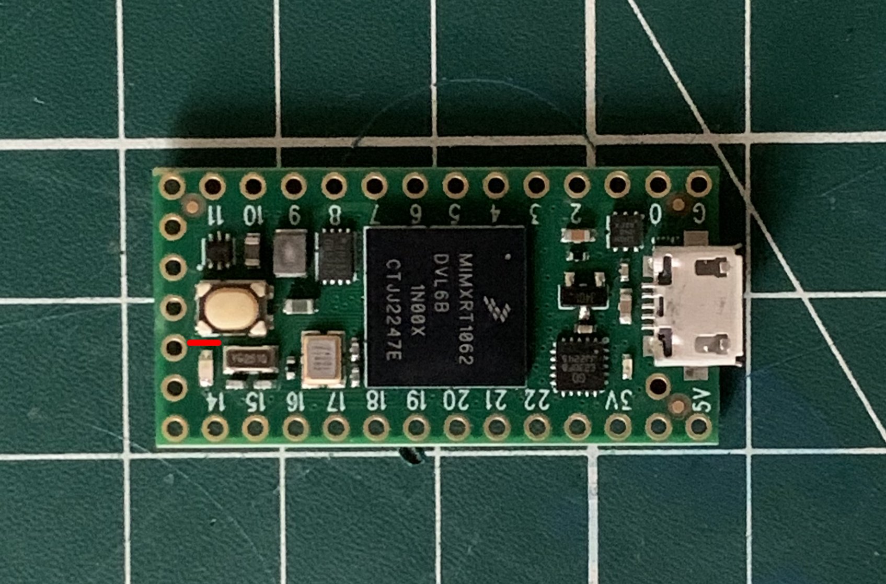

Plug the Teensy again, and check that the led is not blinking anymore. To make sure that you did not damage the Teensy, you can simply use the Teensyduino program to upload any sketch and check that it is still working normally (while the led is not glowing). 

**Then we need to cut the USB power**. This step is not optional as it allows battery to function as expected. USB power will then be routed to the battery for charging and the Teensy will only be powered when an audio jack is inserted. 

There is pads on the belly of the Teensy specifically for that reason. It is situated next to the 5V pin. With the X-acto, cut the trace between the two exposed pads. 

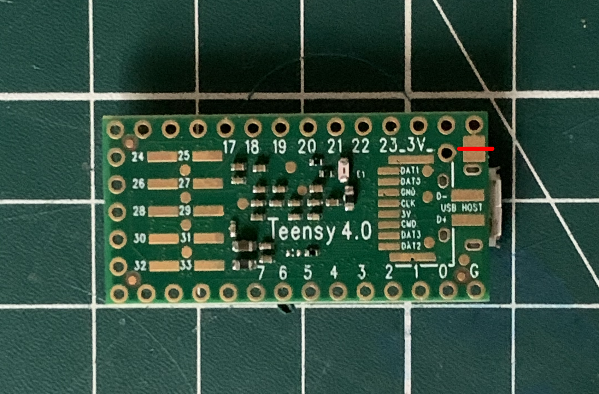

Once it is done, it's a good idea to check with a multimeter that there is indeed no contact between the two pads. 

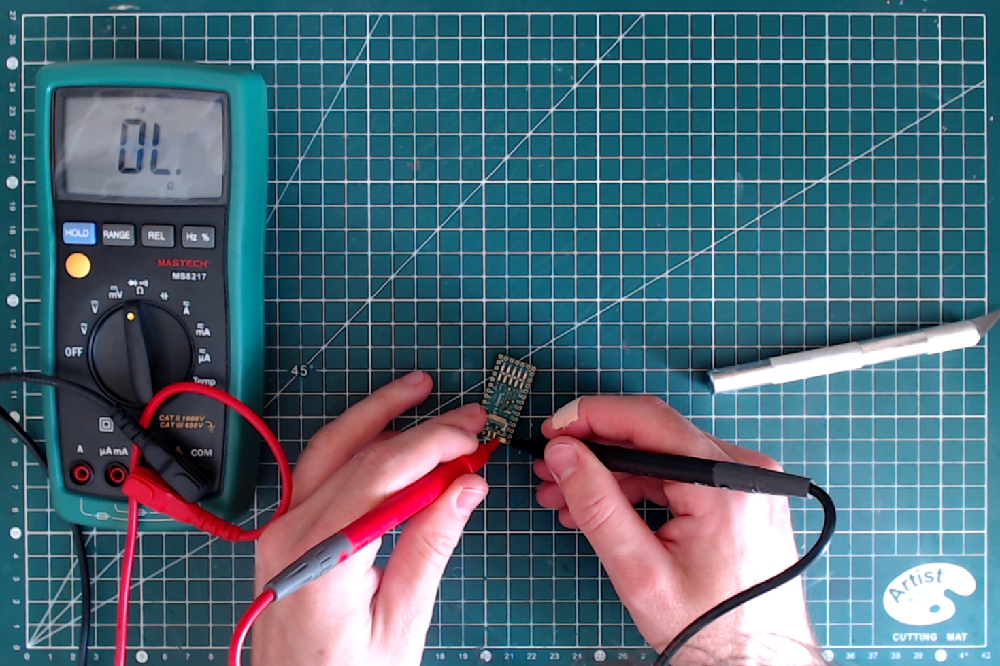

### Potentiometer preparation 

Because of the low clearance within the MiniChord, it is necessary to slightly modify the potentiometers. On the top of the square enclosure, there is four round green plastic spikes. They need to be cut. 

Do that for all three potentiometer, be careful not to cut yourself. 

We can now start with the soldering! 

## Pushbuttons soldering

### 12x12mm pushbuttons

Let's start with the 12x12mm pushbuttons. The first step is to insert them all (21) on the PCB. It is a close fit, so to make it easier start with the middle line of buttons. 

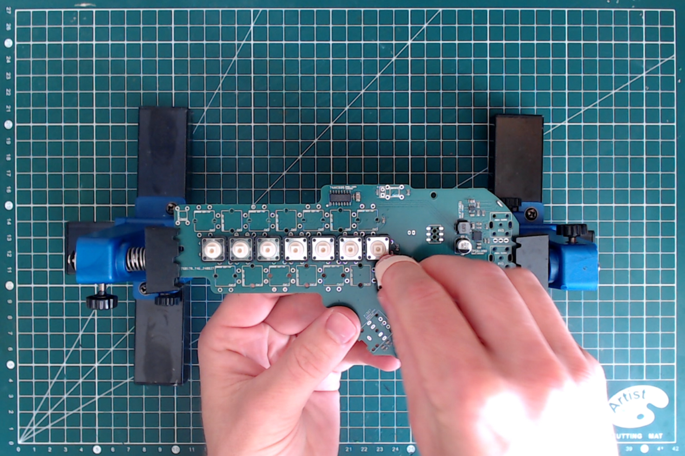

They need to be pushed firmly onto the PCB to properly latch. Make sure that they are all in place and seating flat before starting the soldering. 

Once all buttons are properly soldered, they need to be cut flush on the bottom side on the PCB. It is important because they are seating on top on the battery and we do not want their metal leads to cut into the pouch. 

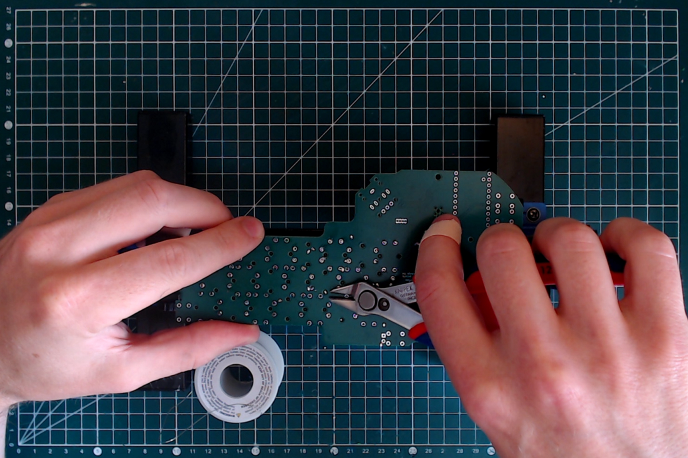

On PCB version 0.4 and above, a white mark shows the precise outline of the battery so you can make sure that nothing protrudes in that zone. Once all buttons are cut flush, make sure to clean the cuttings from the PCB, as they could cause unwanted contact. 

### 6x6mm pushbuttons

The process is very similar to the 12x12mm button. First insert all the four pushbuttons, making sure they are fully seated before soldering. Here clipping the leads is optional but recommended. 

Once done your PCB should look like this:

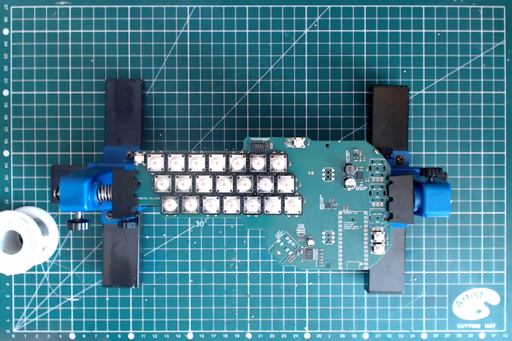

## Audio jack soldering

As before, make sure the jack is fully seated before soldering. 

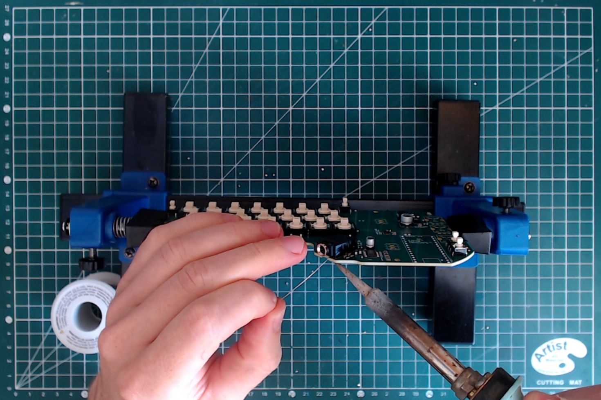

> Note: in PCB v0.3 and before, it is necessary to:

> * cut the top left contact of the Audio jack before soldering (when looking from the top of the PCB, with the jack entry at the bottom);
> * add  a 10k pulldown resistor between the enable and ground pin of the jack (both at the center of it).

## Led soldering 

Two leds need to be soldered. 

**First the RGB led**. The provided led is a RKGB led. Those letters indicate the order of the pins, with R, G and B for the individual colours and K for the common cathode. The K pin is the longest and the position of each pin is indicated on the PCB itself. 

The RGB led needs to be fully seated in place before soldering. 

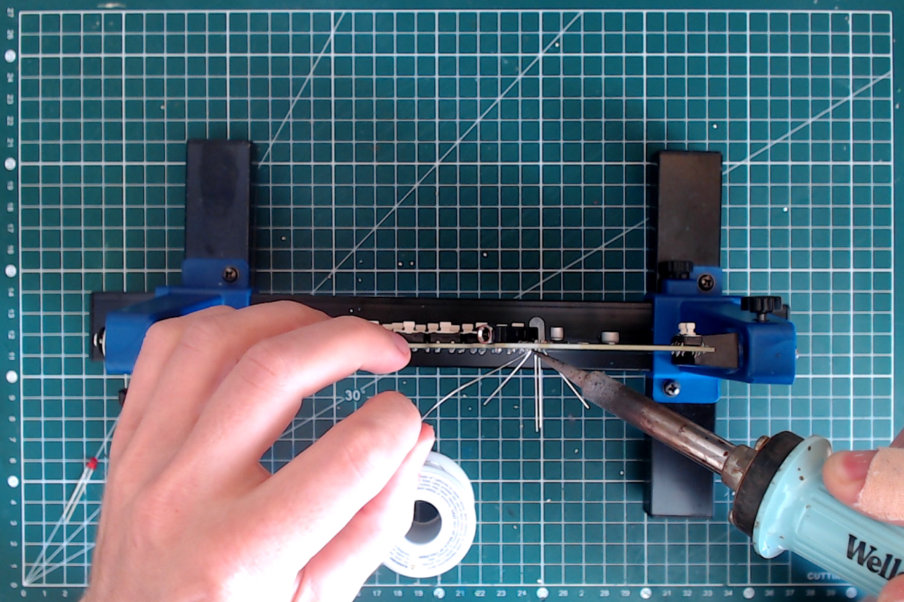

Once soldered, cut the lead flush with the diagonal cutter. 

**The next one is the red led**. The longest pin is the +, and the position of each pin is indicated on the PCB itself. 

This led should not be fully seated. the top of the led should be about the level of the top of the pushbutton next to it.

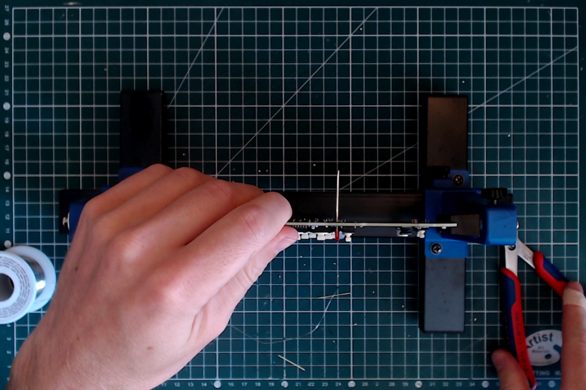

Once soldered, cut the leads flush with the diagonal cutter. 

## Header soldering

Now we need to solder the female header that will allow the touch PCB to connect. 

Those headers are really SMD components but they are really easy to solder. Just put them in place, making sure they are flush (they should hold in place) and solder each pin. 

## Teensy soldering

First prepare the headers using the X-acto knife. You will need:

* Two 14-long header strip for each side of a Teensy;
* A lone header for the out-of-row contact for the VUSB pin. If you are unsure which pin it refers to, take a moment to look at the [Teensy pinout card](https://www.pjrc.com/teensy/card10b_rev2_web.pdf) to identify it and locate its position on the PCB. **Failure to place correctly that header will keep the battery from charging.**

Now you can place the headers on the board, with the short length on the Teensy's side. **Position the Teensy, belly up**, and make sure it is correctly seated. You can then solder the two end of each header line to "tack" the header in place. 

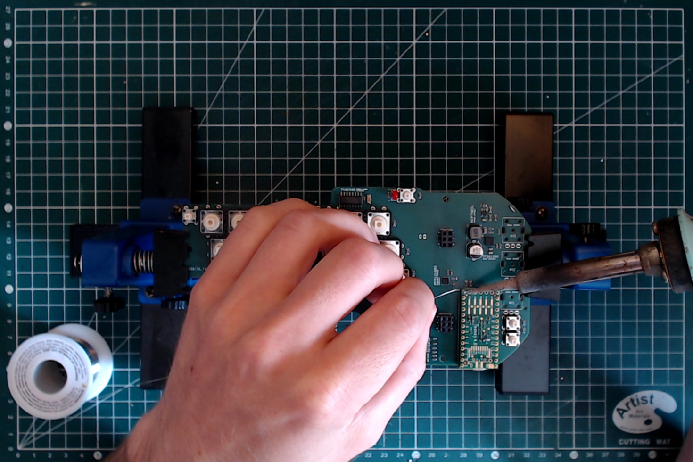

Check that the Teensy is well seated, then do the same on the PCB's side. After a final check that the Teensy is well seated, you can then go over all the contact, both on the Teensy and on the PCB's side and solder them. **Don't forget to solder the VUSB pin**. 

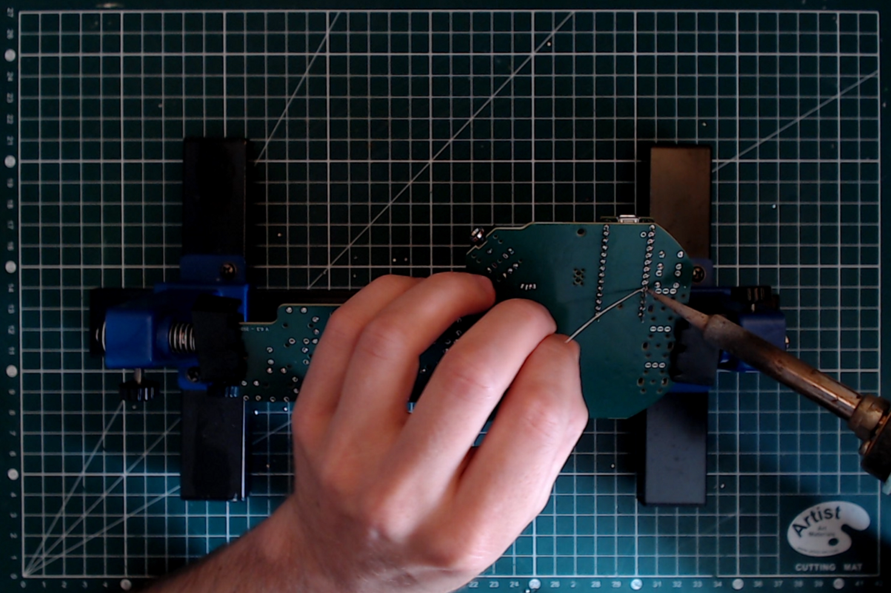

Next, using the diagonal cutters, cut short the excess headers on the PCB's side. 

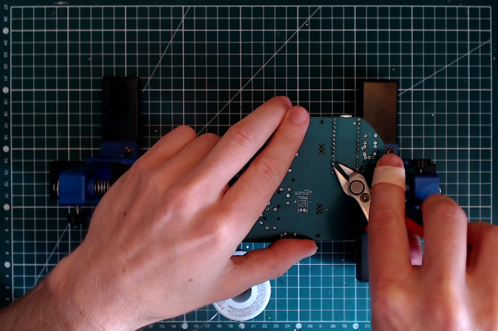

## Potentiometers

First place the three potentiometer. 

Note that a low-profile trace is used, which means that the potentiometer sit deeper than they usually would. Make sure that they are fully seated. 

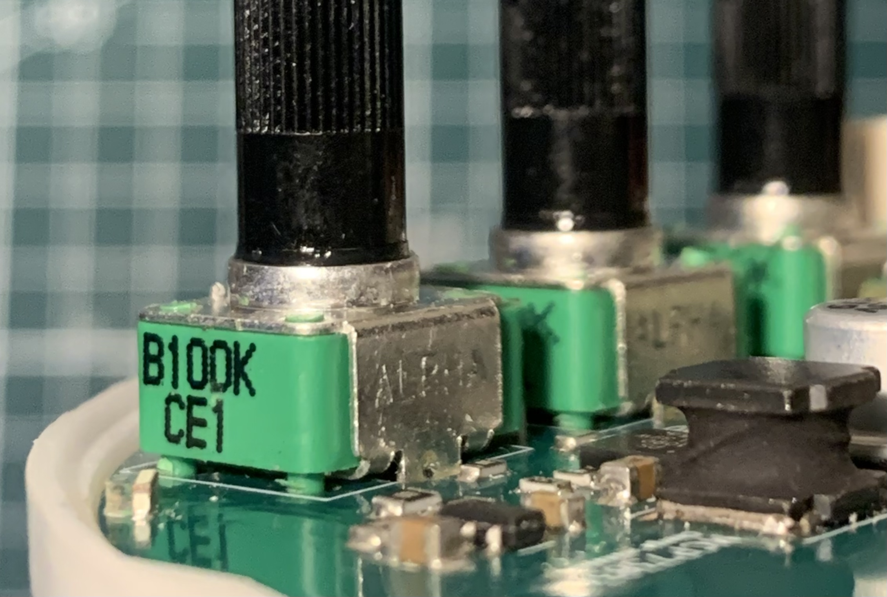

They will hold in place while you solder them. 

## Battery connector

This component is on the backside of the PCB. The silkscreen show the correct position for the connector, so place it accordingly.

**If the connector is installed backward and the battery is connected that way, it will destroy the device**. You need to make sure that when the battery will be connected, the polarity will be respected. 

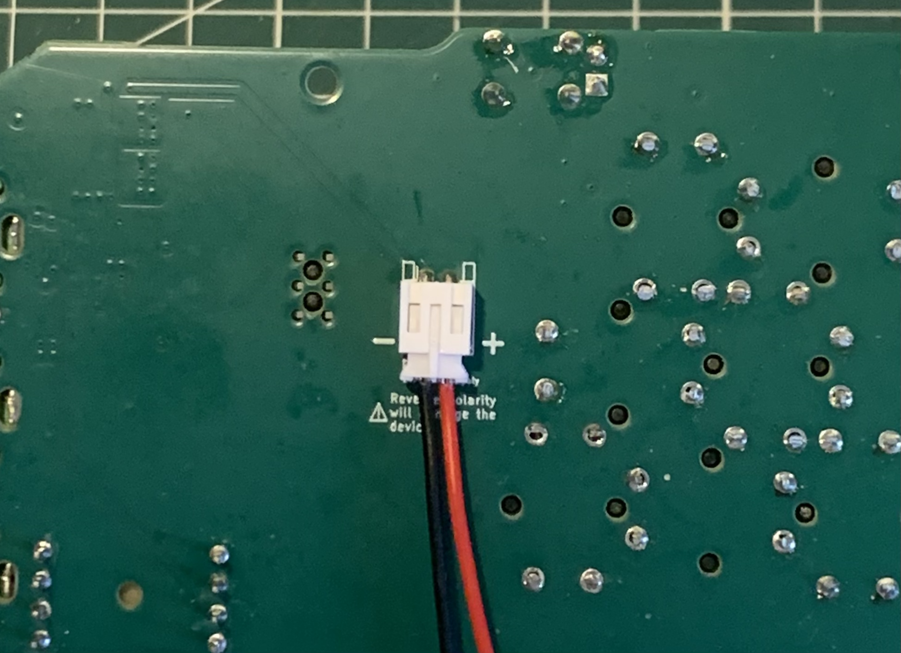

> Note: If you purchased the battery yourself, you need to make sure the connector attached to it is not reversed, as it sometimes happen. In that case choose the orientation of the connector to solder to make sure that the red wire of the battery indeed is connected to the positive side (following the silkscreen marking). 

## Soldering of touch zone PCB

The last bit of soldering needed is the headers on the touch zone PCB. Once again, those are technically SMD components, but easy enough to solder. Just make sure they are well aligned. 

# **Firmware uploading**

    
 <b>BOM</b> 

    <ul>
 
<li>Fully assembled MiniChord PCB; </li>
<li>503450 1000mAh battery;</li>
</ul>

    
 <b>Tools</b> 

    <ul>
 
<li>Micro USB cable (make sure it supports data transfert); </li>
<li>Computer (whether Windows, OSX or Linux);</li>
<li>Headphones;</li>
</ul>

## Testing the board

First it is necessary to make sure the board is properly functioning. 

Without plugging the battery, plug in the micro USB. The power status led should light up green. 

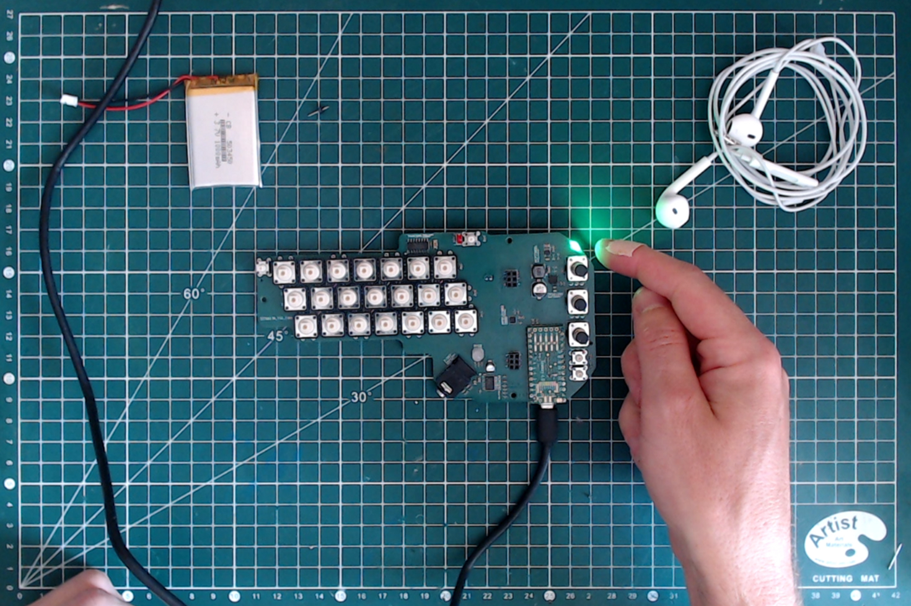.

If it is not green, one the most likely reason is that you forgot to solder the VUSB header. Go back to the [Through-hole soldering](#through-hole_soldering) section and read carefully the part about the Teensy soldering. 

Then plug in the battery. **Make sure that the polarity is respected** (it should be the case if you followed previous instructions). This time the led will be red, indicating that the battery is charging. 

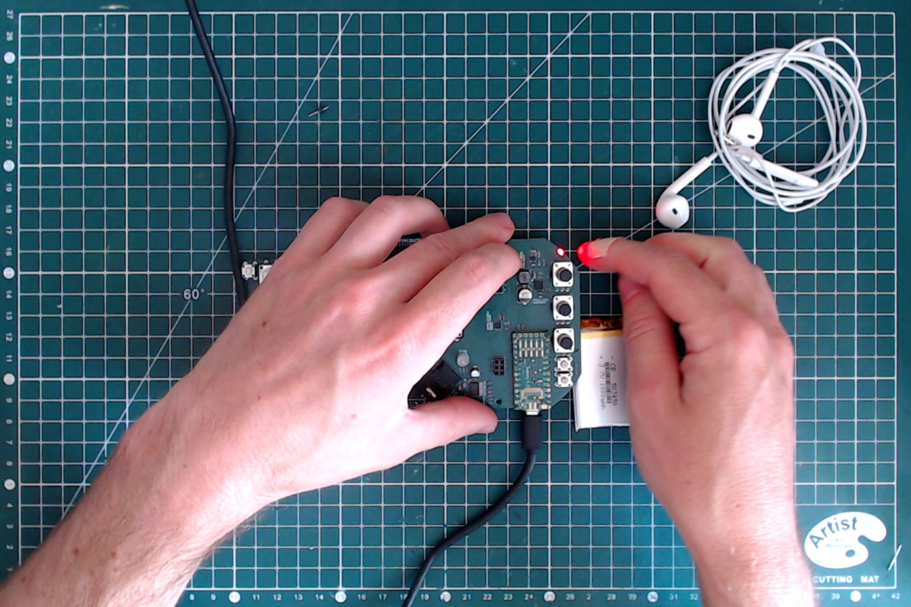.

## Installing the Teensy Loader Application

Next you need to install the application that will allow to upload the firmware. It is provided by PJRC and precise instruction for it are available [on their website](https://www.pjrc.com/teensy/loader.html).

Please note that if you have TeensyDuino installed, the Teensy Loader is included with it. 

## Uploading the firmware

To upload the firmware, please use the following steps:

* Plug the battery into the MiniChord;
* Plug in the micro USB cable between the MiniChord and your computer;
* Plug the headphone into the MiniChord 
* Open the Teensy Loader; 
* Download the hex file of the firmware from the [Source section](/source);
* Drop the hex file on the Teensy loader;

Once all those steps are done, use a header to push on the reset button of the Teensy through the PCB hole. 

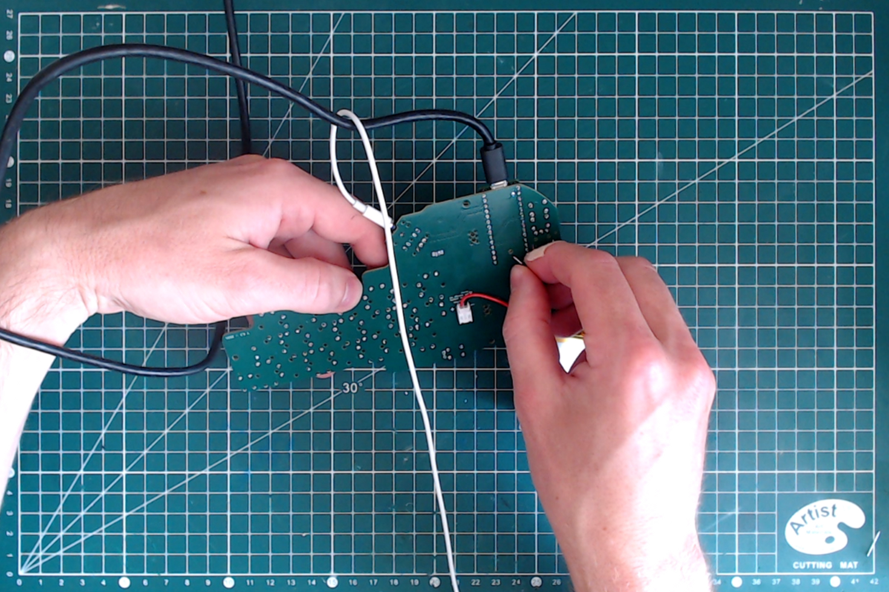

If you carefully followed those steps, the Teensy Loader will indicate "Download Complete" then "Reboot OK". The main colour led of the PCB should light up. 

You can test it by putting the headphones to your hears and push one of the 12x12mm buttons. If you don't hear anything, check that the potentiometers are not turned fully counter-clockwise.

# **Enclosure manufacturing**

The enclosure is composed of two part, the top and the bottom shell. The STL file for those parts is available in the [Source section](/source).

## Printing the parts

Depending on what equipment you have available, **you can choose different alternatives for manufacturing**. 

### FDM printing

If you have a FDM printer, you can use it to make the top and bottom shell. They fit comfortably on a 18x18cm bed. Make sure that you flip the objects to have the flat surface on the bed, no support is required for printing. 

Indicatively, on my Prusa Mini+:

* the top shell takes 2 hours to print on a 0.15mm layer height;
* the bottom shell takes 2 hours and 15 minutes to print on a 0.15mm layer height.

The result is satisfactory, though not great. 

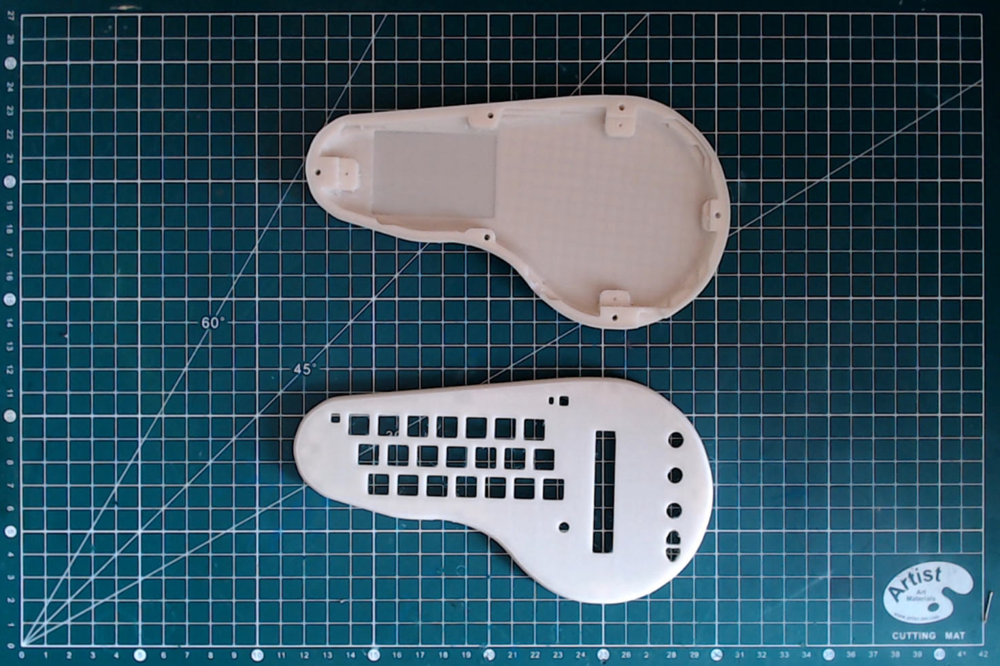

#### SLA resin printing 

For better quality part, SLA resin printing is an economical alternative. Though the equipment is costly, multiple vendors offer affordable online printing services. 

It should cost less than 5€ per part for basic resin choices, for very qualitative parts. Currently 9600 resin is my favorite for a low cost and good quality. 

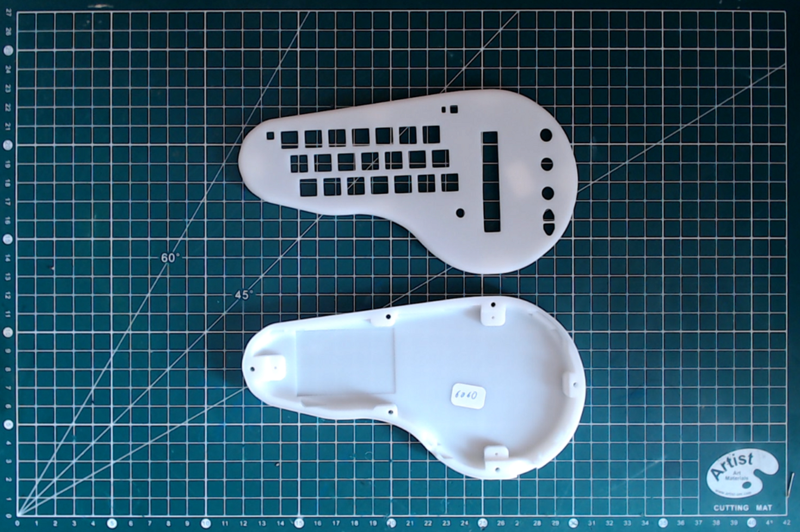

It also possible (for a cost around 1.5x to 2x) to print those part with a transparent resin. 

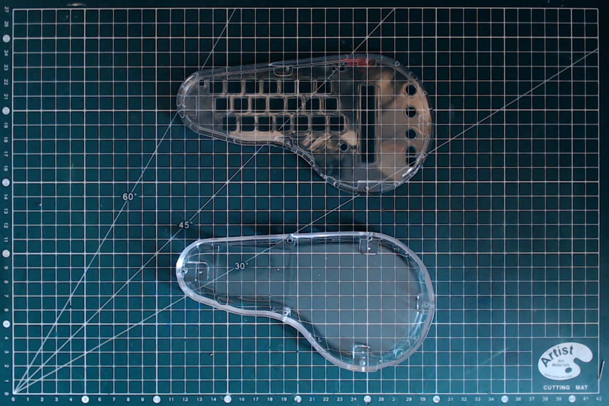

Whether normal or transparent resin, it is possible to use GTC liquid dyes to dye the part, for a very good final result.

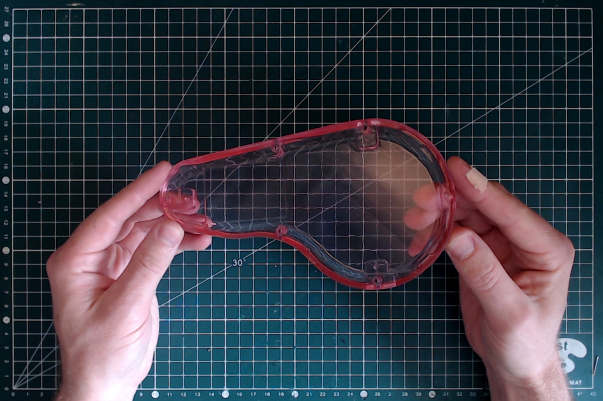

## Adding the labels

Different techniques are possible to add the labels to the shells. 

### UV DTF transfer

The cheapest way to add the marking is a technique called UV DTF transfer. The idea is to print the marking on a film that will then be peeled to apply on the object you want to mark. The marking are full color and very durable. However (and especially in this use case, for very fine marking), it can be a bit finicky to apply. 

You can find the vector file for the UV DTF transfer in the [Source section](/source). There are many local suppliers, and a print should cost you around 5€ per A4 sheet. 

The main difficulty, especially for such fine marking, is to get the printed part stay on the film while peeling. To make sure of that, you need, before starting to peel, to "push" the sheet where there is some graphic components, to help it adhere properly. 

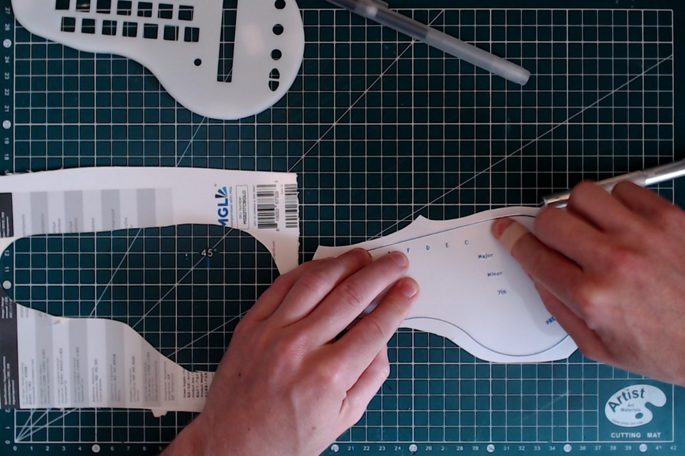

Then, when peeling, place the sheet with the backing on the top and carefuly "roll it back". 

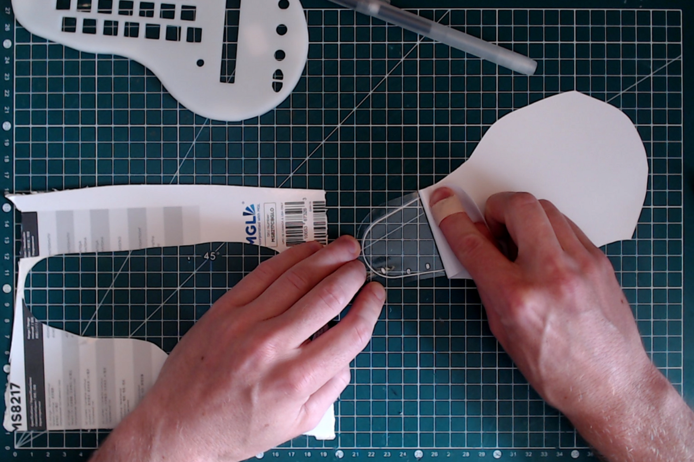

Once your film is properly peeled, the difficulty is to properly place it on the first try as DTF transfer is not repositionnable. To that end, I would advise to make a "frame" out of a catboard cutted to the outline of the top shell. Once the film is on the frame, slowly place it on the top shell. 

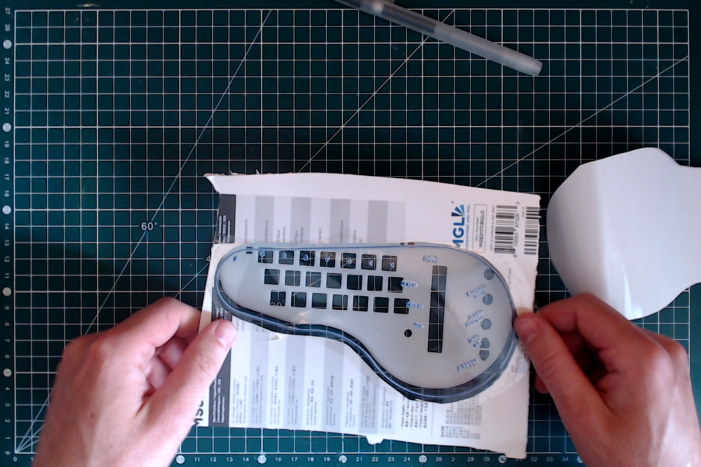

You can then once again push the film firmly down to ensure proper adhesion then remove the backing film. 

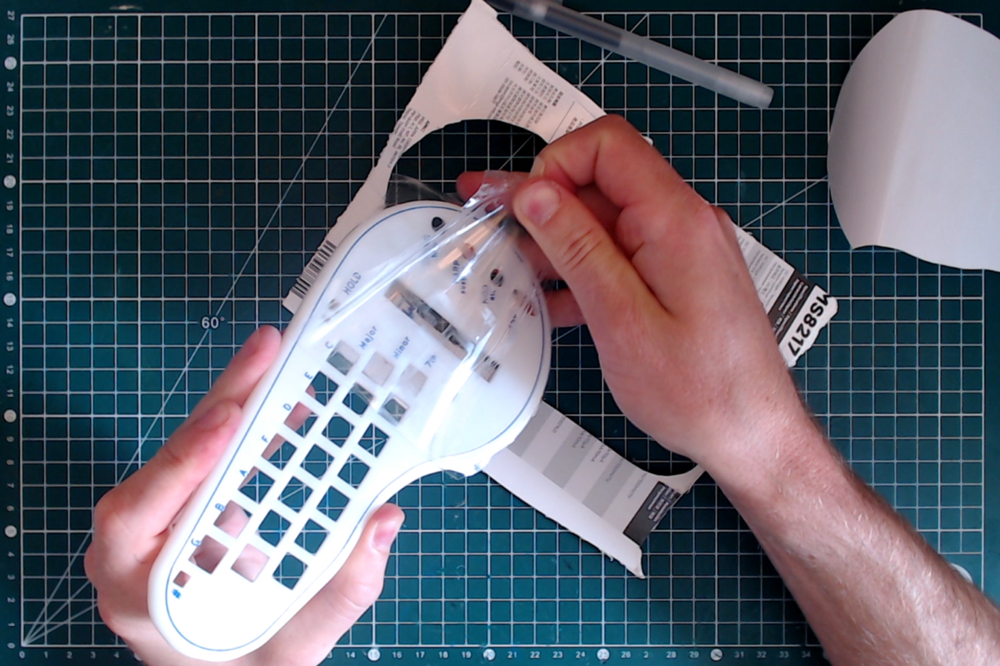

As said beforen, doing it perfectly is not too easy. Still this technique is cheap, doable at home, and can give some very convinving results. 

# **Final assembly**

### Marking transfert 

BOM
- Top and bottom enclosure
- Assembled main PCB 
- Battery 
- touch pcb assembled 
- buttons top 
- m2.3x8 plastic screws X6
- m2.3x4x3

Tools:
exacto, screwdriver 

DO the double sided tape between battery and PCB 

don't overtighten the screws ! its only plastic